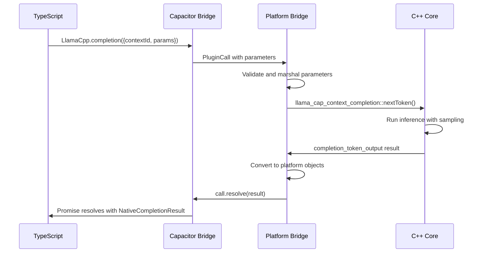
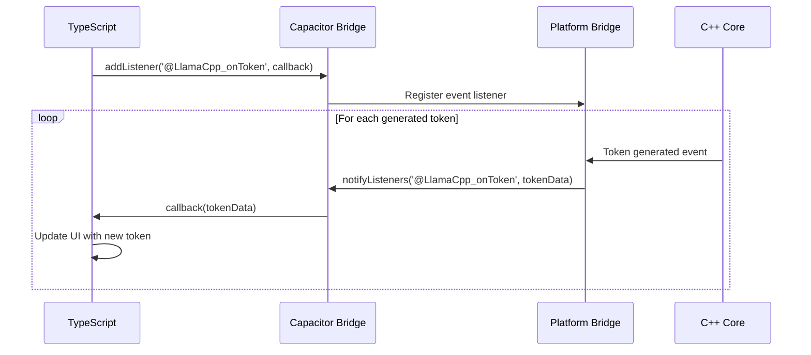

# LlamaCpp Capacitor Plugin - Low-Level Design Document

## Table of Contents
1. [Overview](#overview)
2. [Architecture](#architecture)
3. [API Layer Specifications](#api-layer-specifications)
4. [Core Initialization & Management APIs](#core-initialization--management-apis)
5. [Chat & Completion APIs](#chat--completion-apis)
6. [Session Management APIs](#session-management-apis)
7. [Tokenization APIs](#tokenization-apis)
8. [Embedding & Reranking APIs](#embedding--reranking-apis)
9. [Benchmarking APIs](#benchmarking-apis)
10. [LoRA Adapter APIs](#lora-adapter-apis)
11. [Multimodal APIs](#multimodal-apis)
12. [Text-to-Speech (TTS) APIs](#text-to-speech-tts-apis)
13. [Model Management APIs](#model-management-apis)
14. [Grammar & Structured Output APIs](#grammar--structured-output-apis)
15. [Permission Management APIs](#permission-management-apis)
16. [Event & Utility APIs](#event--utility-apis)
17. [C++ Core Implementation](#c-core-implementation)
18. [Android JNI Bridge](#android-jni-bridge)
19. [iOS Swift Bridge](#ios-swift-bridge)
20. [Data Flow Architecture](#data-flow-architecture)
21. [Error Handling Strategy](#error-handling-strategy)
22. [Performance Optimization](#performance-optimization)
23. [Security Considerations](#security-considerations)

---

## Overview

The LlamaCpp Capacitor Plugin is a cross-platform mobile inference engine that provides native large language model (LLM) capabilities to mobile applications. The plugin bridges JavaScript/TypeScript with native C++ implementation through platform-specific bridges (Android JNI and iOS Swift).

### Key Components

- **TypeScript API Layer**: High-level JavaScript/TypeScript interface
- **Native Bridge Layer**: Platform-specific bridge implementations (Android JNI, iOS Swift)
- **C++ Core Engine**: llama.cpp-based inference engine with mobile optimizations
- **Model Management**: Download, caching, and lifecycle management
- **Multimodal Support**: Vision and audio processing capabilities
- **Structured Output**: Grammar-based and JSON Schema-driven generation

---

## Architecture

```
┌─────────────────────────────────────────────────────────────┐
│                  TypeScript API Layer                       │
├─────────────────────────────────────────────────────────────┤
│                  Platform Bridge Layer                      │
│  ┌─────────────────────┐    ┌─────────────────────────────┐ │
│  │   Android JNI       │    │      iOS Swift             │ │
│  │   jni.cpp           │    │   LlamaCppPlugin.swift     │ │
│  └─────────────────────┘    └─────────────────────────────┘ │
├─────────────────────────────────────────────────────────────┤
│                  C++ Core Engine                           │
│  ┌─────────────────────┐    ┌─────────────────────────────┐ │
│  │   cap-llama.cpp     │    │   cap-completion.cpp        │ │
│  │   Model Management  │    │   Inference Engine          │ │
│  └─────────────────────┘    └─────────────────────────────┘ │
├─────────────────────────────────────────────────────────────┤
│                  llama.cpp Foundation                      │
│  GGML · GGUF · Tokenization · Sampling · KV Cache          │
└─────────────────────────────────────────────────────────────┘
```

---

## API Layer Specifications

### TypeScript API Layer (src/index.ts, src/definitions.ts)

The TypeScript layer provides high-level abstractions and manages the JavaScript-to-native bridge. It includes:

- **LlamaContext Class**: Primary interface for model interaction
- **Utility Functions**: Model management, logging, downloads
- **Type Definitions**: Complete TypeScript interfaces for all data structures
- **Event Management**: Token streaming and progress callbacks

### Platform Bridge Layer

#### Android JNI Bridge (android/src/main/jni.cpp)
- **Purpose**: Bridges Java/TypeScript calls to C++ implementation
- **Responsibilities**: Parameter marshaling, memory management, exception handling
- **Native Methods**: 13 core JNI functions mapping to C++ operations

#### iOS Swift Bridge (ios/Sources/LlamaCppPlugin/)
- **Purpose**: Bridges Swift/TypeScript calls to C++ implementation
- **Responsibilities**: Objective-C++ interop, memory management, async handling
- **Plugin Methods**: 37 Capacitor plugin methods exposing full API surface

### C++ Core Engine (cpp/)

- **cap-llama.cpp**: Main context management and model lifecycle
- **cap-completion.cpp**: Inference engine with speculative decoding
- **cap-tts.cpp**: Text-to-speech vocoder integration
- **cap-mtmd.cpp**: Multimodal image/audio processing

---

## Core Initialization & Management APIs

### 1. toggleNativeLog

**Purpose**: Enable/disable native C++ logging output

#### TypeScript Interface
```typescript
function toggleNativeLog(enabled: boolean): Promise<void>
```

#### Input Parameters
| Parameter | Type | Required | Description |
|-----------|------|----------|-------------|
| enabled | boolean | Yes | Enable (true) or disable (false) native logging |

#### Expected Output
- **Success**: `Promise<void>` - Resolves with no data
- **Error**: Promise rejection with error message

#### Implementation Flow
1. TypeScript → `LlamaCpp.toggleNativeLog({ enabled })`
2. Platform Bridge → Native method call
3. C++ → `capllama::capllama_verbose = enabled`
4. Response → Success/error callback

#### Example Usage
```typescript
// Enable detailed native logging
await toggleNativeLog(true);

// Disable native logging  
await toggleNativeLog(false);
```

---

### 2. setContextLimit

**Purpose**: Set maximum number of concurrent model contexts

#### TypeScript Interface
```typescript
function setContextLimit(limit: number): Promise<void>
```

#### Input Parameters
| Parameter | Type | Required | Description |
|-----------|------|----------|-------------|
| limit | number | Yes | Maximum number of contexts (1-100) |

#### Expected Output
- **Success**: `Promise<void>` - Resolves with no data
- **Error**: Promise rejection with error message

#### Implementation Flow
1. TypeScript → `LlamaCpp.setContextLimit({ limit })`
2. Platform Bridge → Validate limit range
3. C++ → Update global context manager limit
4. Response → Success/error callback

#### Example Usage
```typescript
// Allow up to 5 concurrent contexts
await setContextLimit(5);
```

---

### 3. modelInfo

**Purpose**: Extract metadata and capabilities from a GGUF model file

#### TypeScript Interface
```typescript
function modelInfo(options: { path: string; skip?: string[] }): Promise<Object>
```

#### Input Parameters
| Parameter | Type | Required | Description |
|-----------|------|----------|-------------|
| path | string | Yes | Absolute path to GGUF model file |
| skip | string[] | No | Metadata keys to skip (e.g., ["tokenizer.ggml.tokens"]) |

#### Expected Output
```typescript
Promise<{
  general: {
    name: string;
    description?: string;
    author?: string;
    version?: string;
    size_label?: string;
    license?: string;
  };
  parameters: {
    context_length: number;
    embedding_length: number;
    feed_forward_length: number;
    block_count: number;
    head_count: number;
    head_count_kv: number;
    vocab_size: number;
  };
  tokenizer: {
    model: string;
    pre?: string;
    tokens?: string[];
    scores?: number[];
    token_type?: number[];
  };
  metadata: Record<string, any>;
}>
```

#### Implementation Flow
1. TypeScript → `LlamaCpp.modelInfo({ path, skip })`
2. Platform Bridge → Validate file path exists
3. C++ → `gguf_context_init()` to read model metadata
4. C++ → Parse tensors and extract model parameters
5. Response → Structured metadata object

#### Example Usage
```typescript
const info = await modelInfo({ 
  path: "/models/llama-2-7b.gguf",
  skip: ["tokenizer.ggml.tokens"] // Skip large token arrays
});

console.log(`Model: ${info.general.name}`);
console.log(`Context: ${info.parameters.context_length}`);
console.log(`Vocab: ${info.parameters.vocab_size}`);
```

---

### 4. initContext

**Purpose**: Initialize a new model context with specified parameters

#### TypeScript Interface
```typescript
function initContext(options: { 
  contextId: number; 
  params: NativeContextParams 
}): Promise<NativeLlamaContext>
```

#### Input Parameters
| Parameter | Type | Required | Description |
|-----------|------|----------|-------------|
| contextId | number | Yes | Unique context identifier (0-999) |
| params | NativeContextParams | Yes | Model initialization parameters |

#### NativeContextParams Structure
```typescript
interface NativeContextParams {
  model: string;                    // Path to GGUF model file
  chat_template?: string;           // Override chat template
  is_model_asset?: boolean;         // Model is bundled app asset
  use_progress_callback?: boolean;  // Enable loading progress callbacks
  
  // Context configuration
  n_ctx?: number;                   // Context size (default: 2048)
  n_batch?: number;                 // Batch size (default: 512)
  n_ubatch?: number;                // Micro-batch size
  n_threads?: number;               // CPU threads (default: 4)
  
  // Speculative decoding (Mobile Optimization)
  draft_model?: string;             // Path to draft model
  speculative_samples?: number;     // Speculative tokens (default: 3)
  mobile_speculative?: boolean;     // Mobile-optimized settings
  
  // GPU configuration (iOS only)
  n_gpu_layers?: number;            // GPU layers count
  no_gpu_devices?: boolean;         // Disable GPU
  flash_attn?: boolean;             // Flash attention (experimental)
  
  // KV cache configuration
  cache_type_k?: string;            // K cache type ("f16", "q8_0", etc.)
  cache_type_v?: string;            // V cache type
  kv_unified?: boolean;             // Unified KV cache
  swa_full?: boolean;               // Full SWA cache
  
  // Memory optimization
  use_mlock?: boolean;              // Lock memory pages
  use_mmap?: boolean;               // Memory map model
  vocab_only?: boolean;             // Load vocabulary only
  
  // LoRA adapters
  lora?: string;                    // Single LoRA path
  lora_scaled?: number;             // Single LoRA scale
  lora_list?: Array<{               // Multiple LoRA adapters
    path: string;
    scaled?: number;
  }>;
  
  // RoPE configuration
  rope_freq_base?: number;          // RoPE frequency base
  rope_freq_scale?: number;         // RoPE frequency scale
  
  // Advanced settings
  pooling_type?: number;            // Embedding pooling type
  ctx_shift?: boolean;              // Context shifting
  n_cpu_moe?: number;               // CPU MoE layers
  
  // Embedding mode
  embedding?: boolean;              // Embedding extraction mode
  embd_normalize?: number;          // Embedding normalization
}
```

#### Expected Output
```typescript
Promise<NativeLlamaContext> = {
  contextId: number;                // Assigned context ID
  model: {
    desc: string;                   // Model description
    size: number;                   // Model size in bytes
    nEmbd: number;                  // Embedding dimensions
    nParams: number;                // Parameter count
    chatTemplates: {
      llamaChat: boolean;           // llama-chat support
      minja: {
        default: boolean;           // Default minja support
        defaultCaps: {              // Default capabilities
          tools: boolean;
          toolCalls: boolean;
          toolResponses: boolean;
          systemRole: boolean;
          parallelToolCalls: boolean;
          toolCallId: boolean;
        };
        toolUse: boolean;           // Tool use support
        toolUseCaps: {              // Tool use capabilities
          tools: boolean;
          toolCalls: boolean;
          toolResponses: boolean;
          systemRole: boolean;
          parallelToolCalls: boolean;
          toolCallId: boolean;
        };
      };
    };
    metadata: Object;               // Raw model metadata
    isChatTemplateSupported: boolean; // Legacy chat support
  };
  androidLib?: string;              // Android library name
  gpu: boolean;                     // GPU acceleration enabled
  reasonNoGPU: string;              // GPU disabled reason
}
```

#### Implementation Flow
1. TypeScript → `LlamaCpp.initContext({ contextId, params })`
2. Platform Bridge → Validate contextId uniqueness and params
3. C++ → `llama_cap_context` allocation and initialization
4. C++ → `llama_model_load()` with specified parameters
5. C++ → `llama_context_new()` with model and context params
6. C++ → Initialize speculative decoding if enabled
7. C++ → Extract model metadata and capabilities
8. Response → `NativeLlamaContext` object

#### Example Usage
```typescript
const context = await initContext({
  contextId: 1,
  params: {
    model: "/models/llama-2-7b-chat.gguf",
    n_ctx: 4096,
    n_threads: 6,
    n_gpu_layers: 20,
    draft_model: "/models/llama-2-1b.gguf", // Speculative decoding
    mobile_speculative: true,
    use_progress_callback: true
  }
});

console.log(`Loaded: ${context.model.desc}`);
console.log(`GPU: ${context.gpu}`);
console.log(`Params: ${context.model.nParams.toLocaleString()}`);
```

---

### 5. releaseContext

**Purpose**: Release a specific model context and free associated memory

#### TypeScript Interface
```typescript
function releaseContext(options: { contextId: number }): Promise<void>
```

#### Input Parameters
| Parameter | Type | Required | Description |
|-----------|------|----------|-------------|
| contextId | number | Yes | Context ID to release |

#### Expected Output
- **Success**: `Promise<void>` - Resolves with no data
- **Error**: Promise rejection with error message

#### Implementation Flow
1. TypeScript → `LlamaCpp.releaseContext({ contextId })`
2. Platform Bridge → Validate contextId exists
3. C++ → Stop any active completions
4. C++ → `llama_cap_context` destructor cleanup
5. C++ → Release model, context, and draft model memory
6. Response → Success/error callback

#### Example Usage
```typescript
await releaseContext({ contextId: 1 });
```

---

### 6. releaseAllContexts

**Purpose**: Release all active model contexts and free all memory

#### TypeScript Interface
```typescript
function releaseAllContexts(): Promise<void>
```

#### Input Parameters
None

#### Expected Output
- **Success**: `Promise<void>` - Resolves with no data
- **Error**: Promise rejection with error message

#### Implementation Flow
1. TypeScript → `LlamaCpp.releaseAllContexts()`
2. Platform Bridge → Iterate through all active contexts
3. C++ → Release each context via `releaseContext`
4. C++ → Clear global context registry
5. Response → Success/error callback

#### Example Usage
```typescript
// Clean shutdown
await releaseAllContexts();
```

---

## Chat & Completion APIs

### 7. getFormattedChat

**Purpose**: Format chat messages using model's chat template and extract generation parameters

#### TypeScript Interface
```typescript
function getFormattedChat(options: {
  contextId: number;
  messages: string;
  chatTemplate?: string;
  params?: {
    jinja?: boolean;
    json_schema?: string;
    tools?: string;
    parallel_tool_calls?: string;
    tool_choice?: string;
    enable_thinking?: boolean;
    add_generation_prompt?: boolean;
    now?: string;
    chat_template_kwargs?: string;
  };
}): Promise<JinjaFormattedChatResult | string>
```

#### Input Parameters
| Parameter | Type | Required | Description |
|-----------|------|----------|-------------|
| contextId | number | Yes | Target context ID |
| messages | string | Yes | JSON string of chat messages |
| chatTemplate | string | No | Override chat template |
| params.jinja | boolean | No | Use Jinja template engine |
| params.json_schema | string | No | JSON schema for structured output |
| params.tools | string | No | Available tools JSON |
| params.parallel_tool_calls | string | No | Parallel tool calls config |
| params.tool_choice | string | No | Tool selection strategy |
| params.enable_thinking | boolean | No | Enable reasoning/thinking |
| params.add_generation_prompt | boolean | No | Add generation prompt |
| params.now | string | No | Timestamp for template |
| params.chat_template_kwargs | string | No | Additional template variables |

#### Expected Output
```typescript
// For Jinja templates
Promise<JinjaFormattedChatResult> = {
  type: 'jinja';
  prompt: string;                   // Formatted prompt text
  has_media: boolean;               // Contains images/audio
  media_paths?: string[];           // Media file paths
  chat_format?: number;             // Chat format identifier
  grammar?: string;                 // Generated GBNF grammar
  grammar_lazy?: boolean;           // Lazy grammar evaluation
  grammar_triggers?: Array<{        // Grammar trigger conditions
    type: number;
    value: string;
    token: number;
  }>;
  thinking_forced_open?: boolean;   // Force thinking mode
  preserved_tokens?: string[];      // Tokens to preserve
  additional_stops?: string[];      // Additional stop sequences
}

// For legacy templates
Promise<string> = "formatted_prompt_text"
```

#### Implementation Flow
1. TypeScript → `LlamaCpp.getFormattedChat({ contextId, messages, ... })`
2. Platform Bridge → Parse JSON messages and parameters
3. C++ → Validate chat template compatibility
4. C++ → Apply Jinja template with tools/schema if supported
5. C++ → Generate GBNF grammar from JSON schema if provided
6. C++ → Extract grammar triggers and stop sequences
7. Response → Formatted result object or string

#### Example Usage
```typescript
const formatted = await getFormattedChat({
  contextId: 1,
  messages: JSON.stringify([
    { role: "system", content: "You are a helpful assistant." },
    { role: "user", content: "What's the weather like?" }
  ]),
  params: {
    jinja: true,
    json_schema: JSON.stringify({
      type: "object",
      properties: {
        weather: { type: "string" },
        temperature: { type: "number" }
      }
    }),
    enable_thinking: true
  }
});

if (formatted.type === 'jinja') {
  console.log(`Prompt: ${formatted.prompt}`);
  console.log(`Grammar: ${formatted.grammar}`);
}
```

---

---

### 8. chat

**Purpose**: Chat-first method for conversational AI (equivalent to llama-cli with chat mode)

#### TypeScript Interface
```typescript
function chat(options: {
  contextId: number;
  messages: LlamaCppOAICompatibleMessage[];
  system?: string;
  chatTemplate?: string;
  params?: Omit<NativeCompletionParams, 'prompt' | 'messages'>;
}): Promise<NativeCompletionResult>
```

#### Input Parameters
| Parameter | Type | Required | Description |
|-----------|------|----------|-------------|
| contextId | number | Yes | Target context ID |
| messages | LlamaCppOAICompatibleMessage[] | Yes | Array of chat messages |
| system | string | No | System prompt (like llama-cli -sys) |
| chatTemplate | string | No | Override chat template |
| params | NativeCompletionParams | No | Additional completion parameters |

#### LlamaCppOAICompatibleMessage Structure
```typescript
interface LlamaCppOAICompatibleMessage {
  role: string;                         // "system", "user", "assistant"
  content?: string | LlamaCppMessagePart[];  // Message content
}
```

#### Expected Output
```typescript
Promise<NativeCompletionResult> = {
  // Same structure as completion() method
  text: string;                     // Raw generated text
  reasoning_content: string;        // Extracted reasoning content
  tool_calls: Array<ToolCall>;      // Parsed tool calls
  content: string;                  // Clean content (minus reasoning/tools)
  
  // Generation metadata
  chat_format: number;              // Chat format used
  tokens_predicted: number;         // Tokens generated
  tokens_evaluated: number;         // Tokens processed
  truncated: boolean;               // Output truncated
  stopped_eos: boolean;             // Stopped at EOS token
  
  // Performance metrics
  timings: CompletionTimings;       // Detailed timing information
}
```

#### Implementation Flow
1. TypeScript → `LlamaCpp.chat({ contextId, messages, system, chatTemplate, params })`
2. Platform Bridge → Parse messages array and system prompt
3. C++ → Add system message to beginning of messages if provided
4. C++ → Convert messages to JSON format
5. C++ → Call `getFormattedChat` to format with chat template
6. C++ → Execute completion with formatted prompt
7. Response → Complete `NativeCompletionResult` object

#### Example Usage
```typescript
const result = await chat({
  contextId: 1,
  messages: [
    { role: "user", content: "What is 2+2?" }
  ],
  system: "You are a helpful math tutor",
  params: {
    n_predict: 100,
    temperature: 0.7,
    top_p: 0.9
  }
});

console.log(`Assistant: ${result.content}`);
console.log(`Tokens generated: ${result.tokens_predicted}`);
console.log(`Speed: ${result.timings.predicted_per_second.toFixed(1)} tokens/sec`);
```

---

### 9. chatWithSystem

**Purpose**: Simple chat with system prompt (equivalent to llama-cli -sys "You are a helpful assistant")

#### TypeScript Interface
```typescript
function chatWithSystem(options: {
  contextId: number;
  system: string;
  message: string;
  params?: Omit<NativeCompletionParams, 'prompt' | 'messages'>;
}): Promise<NativeCompletionResult>
```

#### Input Parameters
| Parameter | Type | Required | Description |
|-----------|------|----------|-------------|
| contextId | number | Yes | Target context ID |
| system | string | Yes | System prompt text |
| message | string | Yes | User message content |
| params | NativeCompletionParams | No | Additional completion parameters |

#### Expected Output
```typescript
Promise<NativeCompletionResult> = {
  // Same structure as completion() method
  // See completion method documentation for full structure
}
```

#### Implementation Flow
1. TypeScript → `LlamaCpp.chatWithSystem({ contextId, system, message, params })`
2. Platform Bridge → Create message array with user message
3. C++ → Call internal `chat()` method with system prompt and messages
4. C++ → Format and execute completion
5. Response → Complete `NativeCompletionResult` object

#### Example Usage
```typescript
const result = await chatWithSystem({
  contextId: 1,
  system: "You are a helpful assistant that answers concisely",
  message: "Explain quantum computing in simple terms",
  params: {
    n_predict: 150,
    temperature: 0.8
  }
});

console.log(`Response: ${result.content}`);
```

---

### 10. generateText

**Purpose**: Simple text generation (equivalent to llama-cli -p "prompt")

#### TypeScript Interface
```typescript
function generateText(options: {
  contextId: number;
  prompt: string;
  params?: Omit<NativeCompletionParams, 'prompt' | 'messages'>;
}): Promise<NativeCompletionResult>
```

#### Input Parameters
| Parameter | Type | Required | Description |
|-----------|------|----------|-------------|
| contextId | number | Yes | Target context ID |
| prompt | string | Yes | Text prompt for generation |
| params | NativeCompletionParams | No | Additional completion parameters |

#### Expected Output
```typescript
Promise<NativeCompletionResult> = {
  // Same structure as completion() method
  // See completion method documentation for full structure
}
```

#### Implementation Flow
1. TypeScript → `LlamaCpp.generateText({ contextId, prompt, params })`
2. Platform Bridge → Validate context and parameters
3. C++ → Create completion parameters with prompt
4. C++ → Call native completion directly without chat formatting
5. Response → Complete `NativeCompletionResult` object

#### Example Usage
```typescript
const result = await generateText({
  contextId: 1,
  prompt: "I believe the meaning of life is",
  params: {
    n_predict: 128,
    temperature: 0.9,
    top_k: 40
  }
});

console.log(`Generated text: ${result.text}`);
console.log(`Performance: ${result.timings.predicted_per_second.toFixed(1)} tokens/sec`);
```

---

### 11. completion

**Purpose**: Generate text completion with comprehensive sampling and control parameters

#### TypeScript Interface
```typescript
function completion(options: {
  contextId: number;
  params: NativeCompletionParams;
}): Promise<NativeCompletionResult>
```

#### Input Parameters
| Parameter | Type | Required | Description |
|-----------|------|----------|-------------|
| contextId | number | Yes | Target context ID |
| params | NativeCompletionParams | Yes | Completion generation parameters |

#### NativeCompletionParams Structure
```typescript
interface NativeCompletionParams {
  prompt: string;                   // Input prompt text
  n_threads?: number;               // Inference threads
  
  // Chat template configuration
  jinja?: boolean;                  // Use Jinja templating
  json_schema?: string;             // JSON schema for output
  grammar?: string;                 // GBNF grammar (overrides json_schema)
  grammar_lazy?: boolean;           // Lazy grammar evaluation
  grammar_triggers?: Array<{        // Grammar activation triggers
    type: number;
    value: string;
    token: number;
  }>;
  
  // Reasoning and thinking
  enable_thinking?: boolean;        // Enable reasoning mode
  thinking_forced_open?: boolean;   // Force thinking to be visible
  preserved_tokens?: string[];      // Tokens to preserve
  chat_format?: number;             // Chat format type
  reasoning_format?: string;        // Reasoning format specification
  
  // Multimodal input
  media_paths?: string[];           // Image/audio file paths
  
  // Generation control
  stop?: string[];                  // Stop sequences
  n_predict?: number;               // Max tokens (-1 = unlimited)
  n_probs?: number;                 // Return token probabilities
  
  // Sampling parameters
  top_k?: number;                   // Top-K sampling (default: 40)
  top_p?: number;                   // Top-P sampling (default: 0.95)
  min_p?: number;                   // Min-P sampling (default: 0.05)
  xtc_probability?: number;         // XTC probability (default: 0.0)
  xtc_threshold?: number;           // XTC threshold (default: 0.1)
  typical_p?: number;               // Typical sampling (default: 1.0)
  temperature?: number;             // Sampling temperature (default: 0.8)
  
  // Repetition penalties
  penalty_last_n?: number;          // Penalty window (default: 64)
  penalty_repeat?: number;          // Repetition penalty (default: 1.0)
  penalty_freq?: number;            // Frequency penalty (default: 0.0)
  penalty_present?: number;         // Presence penalty (default: 0.0)
  
  // Mirostat sampling
  mirostat?: number;                // Mirostat mode (0=off, 1=v1, 2=v2)
  mirostat_tau?: number;            // Target entropy (default: 5.0)
  mirostat_eta?: number;            // Learning rate (default: 0.1)
  
  // DRY (Don't Repeat Yourself) sampling
  dry_multiplier?: number;          // DRY penalty multiplier (default: 0.0)
  dry_base?: number;                // DRY base value (default: 1.75)
  dry_allowed_length?: number;      // DRY allowed length (default: 2)
  dry_penalty_last_n?: number;      // DRY scan window (default: -1)
  dry_sequence_breakers?: string[]; // DRY sequence breakers
  
  // Advanced sampling
  top_n_sigma?: number;             // Top-n-sigma sampling (default: -1.0)
  ignore_eos?: boolean;             // Ignore end-of-sequence
  logit_bias?: number[][];          // Logit bias adjustments
  seed?: number;                    // Random seed (-1 = random)
  
  // TTS integration
  guide_tokens?: number[];          // Guide tokens for TTS
  
  emit_partial_completion: boolean; // Stream partial results
}
```

#### Expected Output
```typescript
Promise<NativeCompletionResult> = {
  // Generated content
  text: string;                     // Raw generated text
  reasoning_content: string;        // Extracted reasoning content
  tool_calls: Array<{               // Parsed tool calls
    type: 'function';
    function: {
      name: string;
      arguments: string;            // JSON string
    };
    id?: string;
  }>;
  content: string;                  // Clean content (minus reasoning/tools)
  
  // Generation metadata
  chat_format: number;              // Chat format used
  tokens_predicted: number;         // Tokens generated
  tokens_evaluated: number;         // Tokens processed
  truncated: boolean;               // Output truncated
  stopped_eos: boolean;             // Stopped at EOS token
  stopped_word: string;             // Stop word that triggered end
  stopped_limit: number;            // Token limit reached
  stopping_word: string;            // Actual stopping sequence
  context_full: boolean;            // Context window full
  interrupted: boolean;             // Generation interrupted
  tokens_cached: number;            // Tokens in KV cache
  
  // Performance metrics
  timings: {
    prompt_n: number;               // Prompt tokens
    prompt_ms: number;              // Prompt processing time
    prompt_per_token_ms: number;    // Prompt per-token time
    prompt_per_second: number;      // Prompt tokens/second
    predicted_n: number;            // Generated tokens
    predicted_ms: number;           // Generation time
    predicted_per_token_ms: number; // Generation per-token time
    predicted_per_second: number;   // Generation tokens/second
  };
  
  // Optional features
  completion_probabilities?: Array<{ // Token probabilities
    content: string;
    probs: Array<{
      tok_str: string;
      prob: number;
    }>;
  }>;
  audio_tokens?: number[];          // Generated audio tokens
}
```

#### Implementation Flow
1. TypeScript → `LlamaCpp.completion({ contextId, params })`
2. Platform Bridge → Validate context and marshal parameters
3. C++ → Initialize `llama_cap_context_completion` instance
4. C++ → Apply grammar/schema constraints if specified
5. C++ → Configure sampling parameters
6. C++ → Run inference loop with speculative decoding if enabled
7. C++ → Parse reasoning content and tool calls from output
8. C++ → Calculate performance metrics
9. Response → Complete `NativeCompletionResult` object

#### Example Usage
```typescript
const result = await completion({
  contextId: 1,
  params: {
    prompt: "Write a Python function to calculate fibonacci numbers:",
    n_predict: 200,
    temperature: 0.7,
    top_p: 0.9,
    stop: ["```\n", "\n\n\n"],
    grammar: 'root ::= "```python\\n" ([^`]+ | "`" [^`] | "``" [^`])* "\\n```"',
    emit_partial_completion: true
  }
});

console.log(`Generated: ${result.content}`);
console.log(`Speed: ${result.timings.predicted_per_second.toFixed(1)} tokens/sec`);
console.log(`Efficiency: ${result.tokens_cached}/${result.tokens_evaluated} cached`);
```

---

### 12. stopCompletion

**Purpose**: Interrupt an active text generation process

#### TypeScript Interface
```typescript
function stopCompletion(options: { contextId: number }): Promise<void>
```

#### Input Parameters
| Parameter | Type | Required | Description |
|-----------|------|----------|-------------|
| contextId | number | Yes | Context ID with active completion |

#### Expected Output
- **Success**: `Promise<void>` - Resolves with no data
- **Error**: Promise rejection with error message

#### Implementation Flow
1. TypeScript → `LlamaCpp.stopCompletion({ contextId })`
2. Platform Bridge → Validate contextId exists
3. C++ → Set interruption flag on completion context
4. C++ → Wait for inference loop to acknowledge interruption
5. Response → Success when stopped

#### Example Usage
```typescript
// Start long generation
const generationPromise = completion({
  contextId: 1,
  params: { prompt: "Write a novel...", n_predict: 10000 }
});

// Stop after 5 seconds
setTimeout(() => {
  stopCompletion({ contextId: 1 });
}, 5000);

const result = await generationPromise;
console.log(`Interrupted: ${result.interrupted}`);
```

---

## Session Management APIs

### 8. completion

**Purpose**: Generate text completion with comprehensive sampling and control parameters

#### TypeScript Interface
```typescript
function completion(options: {
  contextId: number;
  params: NativeCompletionParams;
}): Promise<NativeCompletionResult>
```

#### Input Parameters
| Parameter | Type | Required | Description |
|-----------|------|----------|-------------|
| contextId | number | Yes | Target context ID |
| params | NativeCompletionParams | Yes | Completion generation parameters |

#### NativeCompletionParams Structure
```typescript
interface NativeCompletionParams {
  prompt: string;                   // Input prompt text
  n_threads?: number;               // Inference threads
  
  // Chat template configuration
  jinja?: boolean;                  // Use Jinja templating
  json_schema?: string;             // JSON schema for output
  grammar?: string;                 // GBNF grammar (overrides json_schema)
  grammar_lazy?: boolean;           // Lazy grammar evaluation
  grammar_triggers?: Array<{        // Grammar activation triggers
    type: number;
    value: string;
    token: number;
  }>;
  
  // Reasoning and thinking
  enable_thinking?: boolean;        // Enable reasoning mode
  thinking_forced_open?: boolean;   // Force thinking to be visible
  preserved_tokens?: string[];      // Tokens to preserve
  chat_format?: number;             // Chat format type
  reasoning_format?: string;        // Reasoning format specification
  
  // Multimodal input
  media_paths?: string[];           // Image/audio file paths
  
  // Generation control
  stop?: string[];                  // Stop sequences
  n_predict?: number;               // Max tokens (-1 = unlimited)
  n_probs?: number;                 // Return token probabilities
  
  // Sampling parameters
  top_k?: number;                   // Top-K sampling (default: 40)
  top_p?: number;                   // Top-P sampling (default: 0.95)
  min_p?: number;                   // Min-P sampling (default: 0.05)
  xtc_probability?: number;         // XTC probability (default: 0.0)
  xtc_threshold?: number;           // XTC threshold (default: 0.1)
  typical_p?: number;               // Typical sampling (default: 1.0)
  temperature?: number;             // Sampling temperature (default: 0.8)
  
  // Repetition penalties
  penalty_last_n?: number;          // Penalty window (default: 64)
  penalty_repeat?: number;          // Repetition penalty (default: 1.0)
  penalty_freq?: number;            // Frequency penalty (default: 0.0)
  penalty_present?: number;         // Presence penalty (default: 0.0)
  
  // Mirostat sampling
  mirostat?: number;                // Mirostat mode (0=off, 1=v1, 2=v2)
  mirostat_tau?: number;            // Target entropy (default: 5.0)
  mirostat_eta?: number;            // Learning rate (default: 0.1)
  
  // DRY (Don't Repeat Yourself) sampling
  dry_multiplier?: number;          // DRY penalty multiplier (default: 0.0)
  dry_base?: number;                // DRY base value (default: 1.75)
  dry_allowed_length?: number;      // DRY allowed length (default: 2)
  dry_penalty_last_n?: number;      // DRY scan window (default: -1)
  dry_sequence_breakers?: string[]; // DRY sequence breakers
  
  // Advanced sampling
  top_n_sigma?: number;             // Top-n-sigma sampling (default: -1.0)
  ignore_eos?: boolean;             // Ignore end-of-sequence
  logit_bias?: number[][];          // Logit bias adjustments
  seed?: number;                    // Random seed (-1 = random)
  
  // TTS integration
  guide_tokens?: number[];          // Guide tokens for TTS
  
  emit_partial_completion: boolean; // Stream partial results
}
```

#### Expected Output
```typescript
Promise<NativeCompletionResult> = {
  // Generated content
  text: string;                     // Raw generated text
  reasoning_content: string;        // Extracted reasoning content
  tool_calls: Array<{               // Parsed tool calls
    type: 'function';
    function: {
      name: string;
      arguments: string;            // JSON string
    };
    id?: string;
  }>;
  content: string;                  // Clean content (minus reasoning/tools)
  
  // Generation metadata
  chat_format: number;              // Chat format used
  tokens_predicted: number;         // Tokens generated
  tokens_evaluated: number;         // Tokens processed
  truncated: boolean;               // Output truncated
  stopped_eos: boolean;             // Stopped at EOS token
  stopped_word: string;             // Stop word that triggered end
  stopped_limit: number;            // Token limit reached
  stopping_word: string;            // Actual stopping sequence
  context_full: boolean;            // Context window full
  interrupted: boolean;             // Generation interrupted
  tokens_cached: number;            // Tokens in KV cache
  
  // Performance metrics
  timings: {
    prompt_n: number;               // Prompt tokens
    prompt_ms: number;              // Prompt processing time
    prompt_per_token_ms: number;    // Prompt per-token time
    prompt_per_second: number;      // Prompt tokens/second
    predicted_n: number;            // Generated tokens
    predicted_ms: number;           // Generation time
    predicted_per_token_ms: number; // Generation per-token time
    predicted_per_second: number;   // Generation tokens/second
  };
  
  // Optional features
  completion_probabilities?: Array<{ // Token probabilities
    content: string;
    probs: Array<{
      tok_str: string;
      prob: number;
    }>;
  }>;
  audio_tokens?: number[];          // Generated audio tokens
}
```

#### Implementation Flow
1. TypeScript → `LlamaCpp.completion({ contextId, params })`
2. Platform Bridge → Validate context and marshal parameters
3. C++ → Initialize `llama_cap_context_completion` instance
4. C++ → Apply grammar/schema constraints if specified
5. C++ → Configure sampling parameters
6. C++ → Run inference loop with speculative decoding if enabled
7. C++ → Parse reasoning content and tool calls from output
8. C++ → Calculate performance metrics
9. Response → Complete `NativeCompletionResult` object

#### Example Usage
```typescript
const result = await completion({
  contextId: 1,
  params: {
    prompt: "Write a Python function to calculate fibonacci numbers:",
    n_predict: 200,
    temperature: 0.7,
    top_p: 0.9,
    stop: ["```\n", "\n\n\n"],
    grammar: 'root ::= "```python\\n" ([^`]+ | "`" [^`] | "``" [^`])* "\\n```"',
    emit_partial_completion: true
  }
});

console.log(`Generated: ${result.content}`);
console.log(`Speed: ${result.timings.predicted_per_second.toFixed(1)} tokens/sec`);
console.log(`Efficiency: ${result.tokens_cached}/${result.tokens_evaluated} cached`);
```

---

### 9. stopCompletion

**Purpose**: Interrupt an active text generation process

#### TypeScript Interface
```typescript
function stopCompletion(options: { contextId: number }): Promise<void>
```

#### Input Parameters
| Parameter | Type | Required | Description |
|-----------|------|----------|-------------|
| contextId | number | Yes | Context ID with active completion |

#### Expected Output
- **Success**: `Promise<void>` - Resolves with no data
- **Error**: Promise rejection with error message

#### Implementation Flow
1. TypeScript → `LlamaCpp.stopCompletion({ contextId })`
2. Platform Bridge → Validate contextId exists
3. C++ → Set interruption flag on completion context
4. C++ → Wait for inference loop to acknowledge interruption
5. Response → Success when stopped

#### Example Usage
```typescript
// Start long generation
const generationPromise = completion({
  contextId: 1,
  params: { prompt: "Write a novel...", n_predict: 10000 }
});

// Stop after 5 seconds
setTimeout(() => {
  stopCompletion({ contextId: 1 });
}, 5000);

const result = await generationPromise;
console.log(`Interrupted: ${result.interrupted}`);
```

---

## Session Management APIs

### 10. loadSession

**Purpose**: Load previously saved KV cache and prompt state from disk

#### TypeScript Interface
```typescript
function loadSession(options: {
  contextId: number;
  filepath: string;
}): Promise<NativeSessionLoadResult>
```

#### Input Parameters
| Parameter | Type | Required | Description |
|-----------|------|----------|-------------|
| contextId | number | Yes | Target context ID |
| filepath | string | Yes | Path to session file |

#### Expected Output
```typescript
Promise<NativeSessionLoadResult> = {
  tokens_loaded: number;            // Number of tokens restored
  prompt: string;                   // Restored prompt text
}
```

#### Implementation Flow
1. TypeScript → `LlamaCpp.loadSession({ contextId, filepath })`
2. Platform Bridge → Validate file exists and context
3. C++ → Read binary session file header
4. C++ → Restore KV cache state to context
5. C++ → Reconstruct prompt from token sequence
6. Response → Load statistics

#### Example Usage
```typescript
const session = await loadSession({
  contextId: 1,
  filepath: "/storage/chat_session_001.bin"
});

console.log(`Restored ${session.tokens_loaded} tokens`);
console.log(`Prompt: ${session.prompt.slice(0, 100)}...`);
```

---

### 11. saveSession

**Purpose**: Save current KV cache and prompt state to disk for later restoration

#### TypeScript Interface
```typescript
function saveSession(options: {
  contextId: number;
  filepath: string;
  size: number;
}): Promise<number>
```

#### Input Parameters
| Parameter | Type | Required | Description |
|-----------|------|----------|-------------|
| contextId | number | Yes | Source context ID |
| filepath | string | Yes | Output file path |
| size | number | Yes | Number of tokens to save |

#### Expected Output
```typescript
Promise<number> = tokens_saved    // Number of tokens actually saved
```

#### Implementation Flow
1. TypeScript → `LlamaCpp.saveSession({ contextId, filepath, size })`
2. Platform Bridge → Validate context and output path
3. C++ → Extract KV cache state from context
4. C++ → Serialize cache and prompt tokens to binary format
5. C++ → Write session file with metadata header
6. Response → Number of tokens saved

#### Example Usage
```typescript
const tokensSaved = await saveSession({
  contextId: 1,
  filepath: "/storage/chat_session_001.bin",
  size: 2048
});

console.log(`Saved ${tokensSaved} tokens to session`);
```

---

## Tokenization APIs

### 12. tokenize

**Purpose**: Convert text and media inputs into model tokens with metadata

#### TypeScript Interface
```typescript
function tokenize(options: {
  contextId: number;
  text: string;
  imagePaths?: string[];
}): Promise<NativeTokenizeResult>
```

#### Input Parameters
| Parameter | Type | Required | Description |
|-----------|------|----------|-------------|
| contextId | number | Yes | Target context ID |
| text | string | Yes | Input text to tokenize |
| imagePaths | string[] | No | Image file paths for multimodal |

#### Expected Output
```typescript
Promise<NativeTokenizeResult> = {
  tokens: number[];                 // Token IDs
  has_images: boolean;              // Contains image tokens
  bitmap_hashes: number[];          // Image hash identifiers
  chunk_pos: number[];              // Position of text/image chunks
  chunk_pos_images: number[];       // Position of image chunks only
}
```

#### Implementation Flow
1. TypeScript → `LlamaCpp.tokenize({ contextId, text, imagePaths })`
2. Platform Bridge → Validate context and file paths
3. C++ → Process images through multimodal encoder if provided
4. C++ → Tokenize text using model vocabulary
5. C++ → Merge text and image tokens maintaining positions
6. Response → Complete tokenization result

#### Example Usage
```typescript
const tokens = await tokenize({
  contextId: 1,
  text: "Describe this image: ",
  imagePaths: ["/storage/photo.jpg"]
});

console.log(`Tokens: ${tokens.tokens.length}`);
console.log(`Has images: ${tokens.has_images}`);
console.log(`Image positions: ${tokens.chunk_pos_images}`);
```

---

### 13. detokenize

**Purpose**: Convert token IDs back to human-readable text

#### TypeScript Interface
```typescript
function detokenize(options: {
  contextId: number;
  tokens: number[];
}): Promise<string>
```

#### Input Parameters
| Parameter | Type | Required | Description |
|-----------|------|----------|-------------|
| contextId | number | Yes | Source context ID |
| tokens | number[] | Yes | Token IDs to convert |

#### Expected Output
```typescript
Promise<string> = "decoded_text"  // Human-readable text
```

#### Implementation Flow
1. TypeScript → `LlamaCpp.detokenize({ contextId, tokens })`
2. Platform Bridge → Validate context and token array
3. C++ → Look up tokens in model vocabulary
4. C++ → Apply any special token processing
5. C++ → Concatenate decoded text pieces
6. Response → Final decoded string

#### Example Usage
```typescript
const text = await detokenize({
  contextId: 1,
  tokens: [15043, 29892, 920, 526, 366, 29973]
});

console.log(`Decoded: "${text}"`); // "Hello, how are you?"
```

---

## Embedding & Reranking APIs

### 14. embedding

**Purpose**: Generate dense vector embeddings for text input

#### TypeScript Interface
```typescript
function embedding(options: {
  contextId: number;
  text: string;
  params: NativeEmbeddingParams;
}): Promise<NativeEmbeddingResult>
```

#### Input Parameters
| Parameter | Type | Required | Description |
|-----------|------|----------|-------------|
| contextId | number | Yes | Target context ID (must be embedding model) |
| text | string | Yes | Input text to embed |
| params.embd_normalize | number | No | Normalization method (0=none, 1=L2, 2=cosine) |

#### Expected Output
```typescript
Promise<NativeEmbeddingResult> = {
  embedding: number[];              // Dense vector (typically 768-4096 dims)
}
```

#### Implementation Flow
1. TypeScript → `LlamaCpp.embedding({ contextId, text, params })`
2. Platform Bridge → Validate embedding model context
3. C++ → Tokenize input text
4. C++ → Run forward pass without sampling
5. C++ → Extract embedding from final hidden state
6. C++ → Apply normalization if specified
7. Response → Embedding vector

#### Example Usage
```typescript
const embedding = await embedding({
  contextId: 2, // Embedding model context
  text: "The quick brown fox jumps over the lazy dog",
  params: { embd_normalize: 1 } // L2 normalization
});

console.log(`Embedding dims: ${embedding.embedding.length}`);
console.log(`First values: ${embedding.embedding.slice(0, 5)}`);
```

---

### 15. rerank

**Purpose**: Rank documents by relevance to a query using cross-encoder model

#### TypeScript Interface
```typescript
function rerank(options: {
  contextId: number;
  query: string;
  documents: string[];
  params?: NativeRerankParams;
}): Promise<NativeRerankResult[]>
```

#### Input Parameters
| Parameter | Type | Required | Description |
|-----------|------|----------|-------------|
| contextId | number | Yes | Target context ID (must be reranking model) |
| query | string | Yes | Search query |
| documents | string[] | Yes | Documents to rank |
| params.normalize | number | No | Score normalization method |

#### Expected Output
```typescript
Promise<NativeRerankResult[]> = Array<{
  score: number;                    // Relevance score
  index: number;                    // Original document index
}>
```

#### Implementation Flow
1. TypeScript → `LlamaCpp.rerank({ contextId, query, documents, params })`
2. Platform Bridge → Validate reranking model context
3. C++ → Create query-document pairs
4. C++ → Score each pair through cross-encoder
5. C++ → Sort by relevance score
6. Response → Ranked results array

#### Example Usage
```typescript
const ranked = await rerank({
  contextId: 3, // Reranking model context
  query: "machine learning algorithms",
  documents: [
    "Deep learning uses neural networks with multiple layers",
    "Linear regression is a statistical method",
    "Random forests combine multiple decision trees"
  ],
  params: { normalize: 1 }
});

ranked.forEach((result, i) => {
  console.log(`Rank ${i+1}: Score ${result.score.toFixed(3)}, Doc ${result.index}`);
});
```

---

## Benchmarking APIs

### 16. bench

**Purpose**: Run standardized performance benchmark on model context

#### TypeScript Interface
```typescript
function bench(options: {
  contextId: number;
  pp: number;
  tg: number;
  pl: number;
  nr: number;
}): Promise<string>
```

#### Input Parameters
| Parameter | Type | Required | Description |
|-----------|------|----------|-------------|
| contextId | number | Yes | Target context ID |
| pp | number | Yes | Prompt processing tokens |
| tg | number | Yes | Text generation tokens |
| pl | number | Yes | Parallel sequences |
| nr | number | Yes | Number of repetitions |

#### Expected Output
```typescript
Promise<string> = "benchmark_results_json"  // JSON string with metrics
```

#### Expected JSON Structure
```typescript
{
  modelDesc: string;              // Model description
  modelSize: number;              // Model size in bytes
  modelNParams: number;           // Parameter count
  ppAvg: number;                  // Avg prompt processing speed (tokens/sec)
  ppStd: number;                  // Std dev prompt processing speed
  tgAvg: number;                  // Avg text generation speed (tokens/sec)
  tgStd: number;                  // Std dev text generation speed
}
```

#### Implementation Flow
1. TypeScript → `LlamaCpp.bench({ contextId, pp, tg, pl, nr })`
2. Platform Bridge → Validate parameters
3. C++ → Run prompt processing benchmark
4. C++ → Run text generation benchmark
5. C++ → Calculate statistics across repetitions
6. Response → JSON formatted results

#### Example Usage
```typescript
const benchStr = await bench({
  contextId: 1,
  pp: 512,    // Process 512 prompt tokens
  tg: 128,    // Generate 128 tokens
  pl: 1,      // Single sequence
  nr: 5       // 5 repetitions
});

const results = JSON.parse(benchStr);
console.log(`Model: ${results.modelDesc}`);
console.log(`Prompt: ${results.ppAvg.toFixed(1)} ± ${results.ppStd.toFixed(1)} t/s`);
console.log(`Generation: ${results.tgAvg.toFixed(1)} ± ${results.tgStd.toFixed(1)} t/s`);
```

---

## LoRA Adapter APIs

### 17. applyLoraAdapters

**Purpose**: Apply Low-Rank Adaptation (LoRA) adapters to fine-tune model behavior

#### TypeScript Interface
```typescript
function applyLoraAdapters(options: {
  contextId: number;
  loraAdapters: Array<{ path: string; scaled?: number }>;
}): Promise<void>
```

#### Input Parameters
| Parameter | Type | Required | Description |
|-----------|------|----------|-------------|
| contextId | number | Yes | Target context ID |
| loraAdapters | Array<{path, scaled}> | Yes | LoRA adapter configurations |
| loraAdapters[].path | string | Yes | Path to LoRA adapter file |
| loraAdapters[].scaled | number | No | Adapter scaling factor (default: 1.0) |

#### Expected Output
- **Success**: `Promise<void>` - Resolves with no data
- **Error**: Promise rejection with error message

#### Implementation Flow
1. TypeScript → `LlamaCpp.applyLoraAdapters({ contextId, loraAdapters })`
2. Platform Bridge → Validate adapter file paths
3. C++ → Load and validate LoRA adapter files
4. C++ → Apply adapters to model weights with scaling
5. C++ → Update internal adapter registry
6. Response → Success/error callback

#### Example Usage
```typescript
await applyLoraAdapters({
  contextId: 1,
  loraAdapters: [
    { path: "/adapters/coding-assistant.bin", scaled: 1.0 },
    { path: "/adapters/python-expert.bin", scaled: 0.8 }
  ]
});

console.log("LoRA adapters applied successfully");
```

---

### 18. removeLoraAdapters

**Purpose**: Remove all applied LoRA adapters and restore base model weights

#### TypeScript Interface
```typescript
function removeLoraAdapters(options: { contextId: number }): Promise<void>
```

#### Input Parameters
| Parameter | Type | Required | Description |
|-----------|------|----------|-------------|
| contextId | number | Yes | Target context ID |

#### Expected Output
- **Success**: `Promise<void>` - Resolves with no data
- **Error**: Promise rejection with error message

#### Implementation Flow
1. TypeScript → `LlamaCpp.removeLoraAdapters({ contextId })`
2. Platform Bridge → Validate context exists
3. C++ → Remove adapter modifications from model weights
4. C++ → Clear internal adapter registry
5. Response → Success/error callback

#### Example Usage
```typescript
await removeLoraAdapters({ contextId: 1 });
console.log("LoRA adapters removed, base model restored");
```

---

### 19. getLoadedLoraAdapters

**Purpose**: Query currently applied LoRA adapters and their configurations

#### TypeScript Interface
```typescript
function getLoadedLoraAdapters(options: {
  contextId: number;
}): Promise<Array<{ path: string; scaled?: number }>>
```

#### Input Parameters
| Parameter | Type | Required | Description |
|-----------|------|----------|-------------|
| contextId | number | Yes | Target context ID |

#### Expected Output
```typescript
Promise<Array<{
  path: string;                   // LoRA adapter file path
  scaled?: number;                // Applied scaling factor
}>>
```

#### Implementation Flow
1. TypeScript → `LlamaCpp.getLoadedLoraAdapters({ contextId })`
2. Platform Bridge → Validate context exists
3. C++ → Query internal adapter registry
4. Response → Array of loaded adapters

#### Example Usage
```typescript
const adapters = await getLoadedLoraAdapters({ contextId: 1 });

adapters.forEach((adapter, i) => {
  console.log(`Adapter ${i+1}: ${adapter.path} (scale: ${adapter.scaled})`);
});
```

---

## Multimodal APIs

### 20. initMultimodal

**Purpose**: Initialize multimodal support for image and audio processing

#### TypeScript Interface
```typescript
function initMultimodal(options: {
  contextId: number;
  params: {
    path: string;
    use_gpu: boolean;
  };
}): Promise<boolean>
```

#### Input Parameters
| Parameter | Type | Required | Description |
|-----------|------|----------|-------------|
| contextId | number | Yes | Target context ID |
| params.path | string | Yes | Path to multimodal projection model (mmproj) |
| params.use_gpu | boolean | Yes | Enable GPU acceleration for vision encoder |

#### Expected Output
```typescript
Promise<boolean> = initialization_success
```

#### Implementation Flow
1. TypeScript → `LlamaCpp.initMultimodal({ contextId, params })`
2. Platform Bridge → Validate mmproj file exists
3. C++ → Load CLIP/vision encoder model
4. C++ → Initialize image preprocessing pipeline
5. C++ → Setup GPU acceleration if requested and available
6. Response → Success status

#### Example Usage
```typescript
const success = await initMultimodal({
  contextId: 1,
  params: {
    path: "/models/llava-v1.5-7b-mmproj.gguf",
    use_gpu: true
  }
});

if (success) {
  console.log("Multimodal support enabled");
} else {
  console.log("Failed to initialize multimodal support");
}
```

---

### 21. isMultimodalEnabled

**Purpose**: Check if multimodal support is currently active

#### TypeScript Interface
```typescript
function isMultimodalEnabled(options: {
  contextId: number;
}): Promise<boolean>
```

#### Input Parameters
| Parameter | Type | Required | Description |
|-----------|------|----------|-------------|
| contextId | number | Yes | Target context ID |

#### Expected Output
```typescript
Promise<boolean> = is_enabled
```

#### Implementation Flow
1. TypeScript → `LlamaCpp.isMultimodalEnabled({ contextId })`
2. Platform Bridge → Validate context exists
3. C++ → Check multimodal wrapper state
4. Response → Boolean status

#### Example Usage
```typescript
const enabled = await isMultimodalEnabled({ contextId: 1 });
console.log(`Multimodal: ${enabled ? 'enabled' : 'disabled'}`);
```

---

### 22. getMultimodalSupport

**Purpose**: Query specific multimodal capabilities (vision/audio)

#### TypeScript Interface
```typescript
function getMultimodalSupport(options: {
  contextId: number;
}): Promise<{
  vision: boolean;
  audio: boolean;
}>
```

#### Input Parameters
| Parameter | Type | Required | Description |
|-----------|------|----------|-------------|
| contextId | number | Yes | Target context ID |

#### Expected Output
```typescript
Promise<{
  vision: boolean;                // Image processing support
  audio: boolean;                 // Audio processing support
}>
```

#### Implementation Flow
1. TypeScript → `LlamaCpp.getMultimodalSupport({ contextId })`
2. Platform Bridge → Validate context exists
3. C++ → Check vision encoder availability
4. C++ → Check audio encoder availability
5. Response → Capability object

#### Example Usage
```typescript
const support = await getMultimodalSupport({ contextId: 1 });
console.log(`Vision: ${support.vision}, Audio: ${support.audio}`);
```

---

### 23. releaseMultimodal

**Purpose**: Release multimodal resources and disable image/audio processing

#### TypeScript Interface
```typescript
function releaseMultimodal(options: {
  contextId: number;
}): Promise<void>
```

#### Input Parameters
| Parameter | Type | Required | Description |
|-----------|------|----------|-------------|
| contextId | number | Yes | Target context ID |

#### Expected Output
- **Success**: `Promise<void>` - Resolves with no data
- **Error**: Promise rejection with error message

#### Implementation Flow
1. TypeScript → `LlamaCpp.releaseMultimodal({ contextId })`
2. Platform Bridge → Validate context exists
3. C++ → Release vision encoder memory
4. C++ → Clear multimodal wrapper
5. Response → Success/error callback

#### Example Usage
```typescript
await releaseMultimodal({ contextId: 1 });
console.log("Multimodal support disabled");
```

---

## Text-to-Speech (TTS) APIs

### 24. initVocoder

**Purpose**: Initialize text-to-speech vocoder for audio generation

#### TypeScript Interface
```typescript
function initVocoder(options: {
  contextId: number;
  params: {
    path: string;
    n_batch?: number;
  };
}): Promise<boolean>
```

#### Input Parameters
| Parameter | Type | Required | Description |
|-----------|------|----------|-------------|
| contextId | number | Yes | Target context ID |
| params.path | string | Yes | Path to vocoder model file |
| params.n_batch | number | No | Batch size for audio processing |

#### Expected Output
```typescript
Promise<boolean> = initialization_success
```

#### Implementation Flow
1. TypeScript → `LlamaCpp.initVocoder({ contextId, params })`
2. Platform Bridge → Validate vocoder model file
3. C++ → Load vocoder neural network
4. C++ → Initialize audio processing pipeline
5. Response → Success status

#### Example Usage
```typescript
const success = await initVocoder({
  contextId: 1,
  params: {
    path: "/models/bark-vocoder.gguf",
    n_batch: 128
  }
});

if (success) {
  console.log("TTS vocoder ready");
}
```

---

### 25. isVocoderEnabled

**Purpose**: Check if TTS vocoder is currently active

#### TypeScript Interface
```typescript
function isVocoderEnabled(options: { contextId: number }): Promise<boolean>
```

#### Input Parameters
| Parameter | Type | Required | Description |
|-----------|------|----------|-------------|
| contextId | number | Yes | Target context ID |

#### Expected Output
```typescript
Promise<boolean> = is_enabled
```

#### Example Usage
```typescript
const enabled = await isVocoderEnabled({ contextId: 1 });
console.log(`TTS: ${enabled ? 'enabled' : 'disabled'}`);
```

---

### 26. getFormattedAudioCompletion

**Purpose**: Format text for audio generation with speaker characteristics

#### TypeScript Interface
```typescript
function getFormattedAudioCompletion(options: {
  contextId: number;
  speakerJsonStr: string;
  textToSpeak: string;
}): Promise<{
  prompt: string;
  grammar?: string;
}>
```

#### Input Parameters
| Parameter | Type | Required | Description |
|-----------|------|----------|-------------|
| contextId | number | Yes | Target context ID |
| speakerJsonStr | string | Yes | JSON speaker configuration |
| textToSpeak | string | Yes | Text to convert to speech |

#### Expected Output
```typescript
Promise<{
  prompt: string;                 // Formatted prompt for audio generation
  grammar?: string;               // Optional grammar constraints
}>
```

#### Example Usage
```typescript
const audioPrompt = await getFormattedAudioCompletion({
  contextId: 1,
  speakerJsonStr: JSON.stringify({
    voice: "female",
    accent: "american",
    speed: "normal"
  }),
  textToSpeak: "Hello, how are you today?"
});

console.log(`Audio prompt: ${audioPrompt.prompt}`);
```

---

### 27. getAudioCompletionGuideTokens

**Purpose**: Generate guide tokens to improve TTS accuracy

#### TypeScript Interface
```typescript
function getAudioCompletionGuideTokens(options: {
  contextId: number;
  textToSpeak: string;
}): Promise<number[]>
```

#### Input Parameters
| Parameter | Type | Required | Description |
|-----------|------|----------|-------------|
| contextId | number | Yes | Target context ID |
| textToSpeak | string | Yes | Text to generate guide tokens for |

#### Expected Output
```typescript
Promise<number[]> = guide_tokens   // Token IDs for guiding generation
```

#### Example Usage
```typescript
const guideTokens = await getAudioCompletionGuideTokens({
  contextId: 1,
  textToSpeak: "The quick brown fox"
});

console.log(`Guide tokens: ${guideTokens.length}`);
```

---

### 28. decodeAudioTokens

**Purpose**: Convert audio tokens to PCM audio data

#### TypeScript Interface
```typescript
function decodeAudioTokens(options: {
  contextId: number;
  tokens: number[];
}): Promise<number[]>
```

#### Input Parameters
| Parameter | Type | Required | Description |
|-----------|------|----------|-------------|
| contextId | number | Yes | Target context ID with vocoder |
| tokens | number[] | Yes | Audio token IDs to decode |

#### Expected Output
```typescript
Promise<number[]> = pcm_audio_data  // Raw PCM audio samples
```

#### Example Usage
```typescript
const audioData = await decodeAudioTokens({
  contextId: 1,
  tokens: [1234, 5678, 9012] // Audio tokens from completion
});

console.log(`Audio samples: ${audioData.length}`);
// Convert to audio file or play directly
```

---

### 29. releaseVocoder

**Purpose**: Release TTS vocoder resources and disable audio generation

#### TypeScript Interface
```typescript
function releaseVocoder(options: { contextId: number }): Promise<void>
```

#### Input Parameters
| Parameter | Type | Required | Description |
|-----------|------|----------|-------------|
| contextId | number | Yes | Target context ID |

#### Expected Output
- **Success**: `Promise<void>` - Resolves with no data

#### Example Usage
```typescript
await releaseVocoder({ contextId: 1 });
console.log("TTS vocoder released");
```

---

## Model Management APIs

### 30. downloadModel

**Purpose**: Download model files from URL to local storage

#### TypeScript Interface
```typescript
function downloadModel(options: {
  url: string;
  filename: string;
}): Promise<string>
```

#### Input Parameters
| Parameter | Type | Required | Description |
|-----------|------|----------|-------------|
| url | string | Yes | Model download URL |
| filename | string | Yes | Local filename for saved model |

#### Expected Output
```typescript
Promise<string> = local_file_path   // Full path to downloaded file
```

#### Example Usage
```typescript
const modelPath = await downloadModel({
  url: "https://huggingface.co/microsoft/DialoGPT-medium/resolve/main/pytorch_model.bin",
  filename: "dialogpt-medium.gguf"
});

console.log(`Downloaded to: ${modelPath}`);
```

---

### 31. getDownloadProgress

**Purpose**: Monitor download progress for model files

#### TypeScript Interface
```typescript
function getDownloadProgress(options: {
  url: string;
}): Promise<{
  progress: number;
  completed: boolean;
  failed: boolean;
  errorMessage?: string;
  localPath?: string;
  downloadedBytes: number;
  totalBytes: number;
}>
```

#### Input Parameters
| Parameter | Type | Required | Description |
|-----------|------|----------|-------------|
| url | string | Yes | URL being downloaded |

#### Expected Output
```typescript
Promise<{
  progress: number;               // 0.0 to 1.0 (percentage)
  completed: boolean;             // Download finished successfully
  failed: boolean;                // Download failed
  errorMessage?: string;          // Error description if failed
  localPath?: string;             // Local file path if completed
  downloadedBytes: number;        // Bytes downloaded so far
  totalBytes: number;             // Total file size in bytes
}>
```

#### Example Usage
```typescript
const progress = await getDownloadProgress({
  url: "https://huggingface.co/microsoft/DialoGPT-medium/resolve/main/pytorch_model.bin"
});

console.log(`Progress: ${(progress.progress * 100).toFixed(1)}%`);
console.log(`Downloaded: ${progress.downloadedBytes}/${progress.totalBytes} bytes`);
```

---

### 32. cancelDownload

**Purpose**: Cancel an active model download

#### TypeScript Interface
```typescript
function cancelDownload(options: {
  url: string;
}): Promise<boolean>
```

#### Input Parameters
| Parameter | Type | Required | Description |
|-----------|------|----------|-------------|
| url | string | Yes | URL download to cancel |

#### Expected Output
```typescript
Promise<boolean> = cancellation_success
```

#### Example Usage
```typescript
const cancelled = await cancelDownload({
  url: "https://huggingface.co/microsoft/DialoGPT-medium/resolve/main/pytorch_model.bin"
});

if (cancelled) {
  console.log("Download cancelled successfully");
}
```

---

### 33. getAvailableModels

**Purpose**: List locally available model files

#### TypeScript Interface
```typescript
function getAvailableModels(): Promise<Array<{
  name: string;
  path: string;
  size: number;
}>>
```

#### Input Parameters
None

#### Expected Output
```typescript
Promise<Array<{
  name: string;                   // Model filename
  path: string;                   // Full file path
  size: number;                   // File size in bytes
}>>
```

#### Example Usage
```typescript
const models = await getAvailableModels();

models.forEach(model => {
  const sizeMB = (model.size / 1024 / 1024).toFixed(1);
  console.log(`${model.name}: ${sizeMB} MB`);
});
```

---

## Grammar & Structured Output APIs

### 34. convertJsonSchemaToGrammar

**Purpose**: Convert JSON Schema to GBNF grammar for structured output

#### TypeScript Interface
```typescript
function convertJsonSchemaToGrammar(options: {
  schema: string;
}): Promise<string>
```

#### Input Parameters
| Parameter | Type | Required | Description |
|-----------|------|----------|-------------|
| schema | string | Yes | JSON Schema as string |

#### Expected Output
```typescript
Promise<string> = gbnf_grammar     // GBNF grammar string
```

#### Example Usage
```typescript
const schema = JSON.stringify({
  type: "object",
  properties: {
    name: { type: "string" },
    age: { type: "number" },
    hobbies: {
      type: "array",
      items: { type: "string" }
    }
  },
  required: ["name", "age"]
});

const grammar = await convertJsonSchemaToGrammar({ schema });
console.log(`Grammar: ${grammar}`);

// Use in completion
const result = await completion({
  contextId: 1,
  params: {
    prompt: "Generate a person profile:",
    grammar: grammar,
    n_predict: 100
  }
});
```

---

## Permission Management APIs

### 4. requestPermissions

**Purpose**: Request necessary device permissions for file access and storage

#### TypeScript Interface
```typescript
function requestPermissions(): Promise<void>
```

#### Input Parameters
None

#### Expected Output
- **Success**: `Promise<void>` - Resolves when permissions granted
- **Error**: Promise rejection with permission denial message

#### Implementation Flow
1. TypeScript → `LlamaCpp.requestPermissions()`
2. Platform Bridge → Check current permission status
3. Platform Native → Request storage/file access permissions
4. User → Grant or deny permissions via system dialog
5. Response → Success/error based on user choice

#### Example Usage
```typescript
try {
  await requestPermissions();
  console.log("Permissions granted");
} catch (error) {
  console.log("Permissions denied:", error.message);
}
```

---

### 28. checkPermissions

**Purpose**: Check current status of required device permissions

#### TypeScript Interface
```typescript
function checkPermissions(): Promise<{
  storage: 'granted' | 'denied' | 'prompt';
  files: 'granted' | 'denied' | 'prompt';
}>
```

#### Input Parameters
None

#### Expected Output
```typescript
Promise<{
  storage: 'granted' | 'denied' | 'prompt';  // External storage access
  files: 'granted' | 'denied' | 'prompt';    // File system access
}>
```

#### Implementation Flow
1. TypeScript → `LlamaCpp.checkPermissions()`
2. Platform Bridge → Query system permission status
3. Platform Native → Check individual permission states
4. Response → Permission status object

#### Example Usage
```typescript
const permissions = await checkPermissions();

if (permissions.storage !== 'granted') {
  console.log("Storage permission required");
  await requestPermissions();
}
```

---

## Event & Utility APIs

### 35. addListener

**Purpose**: Register event listeners for token streaming and progress updates

#### TypeScript Interface
```typescript
function addListener(eventName: string, listenerFunc: (data: any) => void): Promise<void>
```

#### Input Parameters
| Parameter | Type | Required | Description |
|-----------|------|----------|-------------|
| eventName | string | Yes | Event name to listen for |
| listenerFunc | Function | Yes | Callback function for events |

#### Supported Events
| Event Name | Data Type | Description |
|-----------|-----------|-------------|
| `@LlamaCpp_onToken` | `TokenData` | Token generated during completion |
| `@LlamaCpp_onInitContextProgress` | `{progress: number}` | Model loading progress |
| `@LlamaCpp_onNativeLog` | `{level: string, text: string}` | Native C++ log messages |

#### Example Usage
```typescript
// Listen for tokens during generation
await addListener('@LlamaCpp_onToken', (tokenData) => {
  process.stdout.write(tokenData.token);
});

// Listen for model loading progress
await addListener('@LlamaCpp_onInitContextProgress', (progress) => {
  console.log(`Loading: ${(progress.progress * 100).toFixed(1)}%`);
});
```

---

### 36. removeAllListeners

**Purpose**: Remove all registered event listeners for a specific event

#### TypeScript Interface
```typescript
function removeAllListeners(eventName: string): Promise<void>
```

#### Input Parameters
| Parameter | Type | Required | Description |
|-----------|------|----------|-------------|
| eventName | string | Yes | Event name to clear listeners for |

#### Example Usage
```typescript
// Clear all token listeners
await removeAllListeners('@LlamaCpp_onToken');
```

---

## C++ Core Implementation

### llama_cap_context Class (cpp/cap-llama.h)

The core context class manages model lifecycle and inference state.

#### Key Methods

```cpp
class llama_cap_context {
public:
    // Model management
    bool loadModel(common_params &params_);
    
    // Speculative decoding
    bool loadDraftModel(const std::string &draft_model_path);
    void releaseDraftModel();
    bool isSpectulativeEnabled() const;
    
    // Chat formatting
    common_chat_params getFormattedChatWithJinja(/*...*/);
    std::string getFormattedChat(/*...*/);
    
    // Tokenization
    llama_cap_tokenize_result tokenize(const std::string &text, 
                                       const std::vector<std::string> &media_paths);
    
    // LoRA management
    int applyLoraAdapters(std::vector<common_adapter_lora_info> lora);
    void removeLoraAdapters();
    std::vector<common_adapter_lora_info> getLoadedLoraAdapters();
    
    // Multimodal support
    bool initMultimodal(const std::string &mmproj_path, bool use_gpu);
    bool isMultimodalEnabled() const;
    void releaseMultimodal();
    
    // TTS support
    bool initVocoder(const std::string &vocoder_model_path, int batch_size = -1);
    bool isVocoderEnabled() const;
    void releaseVocoder();
};
```

### llama_cap_context_completion Class (cpp/cap-completion.h)

Manages inference and sampling state.

#### Key Methods

```cpp
class llama_cap_context_completion {
public:
    // Token generation
    completion_token_output nextToken();
    completion_token_output nextTokenSpeculative();
    
    // Speculative decoding
    void draftTokens(int n_draft);
    int verifyAndAcceptTokens(const std::vector<llama_token> &draft_tokens);
    
    // State management
    void clear();
    bool has_next_token = true;
    bool truncated = false;
    bool stopped_eos = false;
    bool interrupted = false;
    
    // Performance metrics
    completion_token_output getPartialOutput();
};
```

---

## Android JNI Bridge

### JNI Method Signatures

The Android bridge provides 13 core JNI methods:

```cpp
// Context management
JNIEXPORT jlong JNICALL
Java_ai_annadata_plugin_capacitor_LlamaCpp_initContextNative(
    JNIEnv *env, jobject thiz, jstring modelPath, jobjectArray searchPaths, jobject params);

JNIEXPORT void JNICALL
Java_ai_annadata_plugin_capacitor_LlamaCpp_releaseContextNative(
    JNIEnv* env, jobject thiz, jlong context_id);

// Text generation
JNIEXPORT jobject JNICALL
Java_ai_annadata_plugin_capacitor_LlamaCpp_completionNative(
    JNIEnv* env, jobject thiz, jlong context_id, jobject params);

JNIEXPORT void JNICALL
Java_ai_annadata_plugin_capacitor_LlamaCpp_stopCompletionNative(
    JNIEnv* env, jobject thiz, jlong context_id);

// Chat formatting
JNIEXPORT jstring JNICALL
Java_ai_annadata_plugin_capacitor_LlamaCpp_getFormattedChatNative(
    JNIEnv* env, jobject thiz, jlong context_id, jstring messages, jstring chat_template);

// Utilities
JNIEXPORT jboolean JNICALL
Java_ai_annadata_plugin_capacitor_LlamaCpp_toggleNativeLogNative(
    JNIEnv* env, jobject thiz, jboolean enabled);

JNIEXPORT jobject JNICALL
Java_ai_annadata_plugin_capacitor_LlamaCpp_modelInfoNative(
    JNIEnv* env, jobject thiz, jstring model_path);

// Model management
JNIEXPORT jstring JNICALL
Java_ai_annadata_plugin_capacitor_LlamaCpp_downloadModelNative(
    JNIEnv* env, jobject thiz, jstring url, jstring filename);

JNIEXPORT jobject JNICALL
Java_ai_annadata_plugin_capacitor_LlamaCpp_getDownloadProgressNative(
    JNIEnv* env, jobject thiz, jstring url);

JNIEXPORT jboolean JNICALL
Java_ai_annadata_plugin_capacitor_LlamaCpp_cancelDownloadNative(
    JNIEnv* env, jobject thiz, jstring url);

JNIEXPORT jobject JNICALL
Java_ai_annadata_plugin_capacitor_LlamaCpp_getAvailableModelsNative(
    JNIEnv* env, jobject thiz);

// Tokenization
JNIEXPORT jobject JNICALL
Java_ai_annadata_plugin_capacitor_LlamaCpp_tokenizeNative(
    JNIEnv* env, jobject thiz, jlong contextId, jstring text, jobjectArray imagePaths);

JNIEXPORT jstring JNICALL
Java_ai_annadata_plugin_capacitor_LlamaCpp_detokenizeNative(
    JNIEnv* env, jobject thiz, jlong contextId, jintArray tokens);
```

### Parameter Marshaling

The JNI bridge handles conversion between Java/JavaScript types and C++ types:

```cpp
// Extract completion parameters from JSObject
std::string extractStringParam(JNIEnv* env, jobject params, const char* key) {
    jclass jsObjectClass = env->FindClass("com/getcapacitor/JSObject");
    jmethodID getStringMethod = env->GetMethodID(jsObjectClass, "getString", "(Ljava/lang/String;)Ljava/lang/String;");
    jstring keyStr = env->NewStringUTF(key);
    jstring result = (jstring)env->CallObjectMethod(params, getStringMethod, keyStr);
    // Convert to std::string and return
}

// Convert C++ results to Java objects
jobject createCompletionResult(JNIEnv* env, const completion_token_output& result) {
    jclass jsObjectClass = env->FindClass("com/getcapacitor/JSObject");
    jmethodID constructor = env->GetMethodID(jsObjectClass, "<init>", "()V");
    jobject jsObject = env->NewObject(jsObjectClass, constructor);
    
    // Add fields to JSObject
    jmethodID putMethod = env->GetMethodID(jsObjectClass, "put", "(Ljava/lang/String;Ljava/lang/Object;)V");
    // ... populate result fields
    
    return jsObject;
}
```

---

## iOS Swift Bridge

### Capacitor Plugin Methods

The iOS bridge exposes 37 Capacitor plugin methods:

```swift
public let pluginMethods: [CAPPluginMethod] = [
    // Core initialization
    CAPPluginMethod(name: "toggleNativeLog", returnType: CAPPluginReturnPromise),
    CAPPluginMethod(name: "setContextLimit", returnType: CAPPluginReturnPromise),
    CAPPluginMethod(name: "modelInfo", returnType: CAPPluginReturnPromise),
    CAPPluginMethod(name: "initContext", returnType: CAPPluginReturnPromise),
    CAPPluginMethod(name: "releaseContext", returnType: CAPPluginReturnPromise),
    CAPPluginMethod(name: "releaseAllContexts", returnType: CAPPluginReturnPromise),
    
    // Completion and chat
    CAPPluginMethod(name: "getFormattedChat", returnType: CAPPluginReturnPromise),
    CAPPluginMethod(name: "completion", returnType: CAPPluginReturnPromise),
    CAPPluginMethod(name: "stopCompletion", returnType: CAPPluginReturnPromise),
    
    // Session management
    CAPPluginMethod(name: "loadSession", returnType: CAPPluginReturnPromise),
    CAPPluginMethod(name: "saveSession", returnType: CAPPluginReturnPromise),
    
    // Tokenization
    CAPPluginMethod(name: "tokenize", returnType: CAPPluginReturnPromise),
    CAPPluginMethod(name: "detokenize", returnType: CAPPluginReturnPromise),
    
    // Embeddings and reranking
    CAPPluginMethod(name: "embedding", returnType: CAPPluginReturnPromise),
    CAPPluginMethod(name: "rerank", returnType: CAPPluginReturnPromise),
    
    // Benchmarking
    CAPPluginMethod(name: "bench", returnType: CAPPluginReturnPromise),
    
    // LoRA adapters
    CAPPluginMethod(name: "applyLoraAdapters", returnType: CAPPluginReturnPromise),
    CAPPluginMethod(name: "removeLoraAdapters", returnType: CAPPluginReturnPromise),
    CAPPluginMethod(name: "getLoadedLoraAdapters", returnType: CAPPluginReturnPromise),
    
    // Multimodal
    CAPPluginMethod(name: "initMultimodal", returnType: CAPPluginReturnPromise),
    CAPPluginMethod(name: "isMultimodalEnabled", returnType: CAPPluginReturnPromise),
    CAPPluginMethod(name: "getMultimodalSupport", returnType: CAPPluginReturnPromise),
    CAPPluginMethod(name: "releaseMultimodal", returnType: CAPPluginReturnPromise),
    
    // TTS
    CAPPluginMethod(name: "initVocoder", returnType: CAPPluginReturnPromise),
    CAPPluginMethod(name: "isVocoderEnabled", returnType: CAPPluginReturnPromise),
    CAPPluginMethod(name: "getFormattedAudioCompletion", returnType: CAPPluginReturnPromise),
    CAPPluginMethod(name: "getAudioCompletionGuideTokens", returnType: CAPPluginReturnPromise),
    CAPPluginMethod(name: "decodeAudioTokens", returnType: CAPPluginReturnPromise),
    CAPPluginMethod(name: "releaseVocoder", returnType: CAPPluginReturnPromise),
    
    // Model management
    CAPPluginMethod(name: "downloadModel", returnType: CAPPluginReturnPromise),
    CAPPluginMethod(name: "getDownloadProgress", returnType: CAPPluginReturnPromise),
    CAPPluginMethod(name: "cancelDownload", returnType: CAPPluginReturnPromise),
    CAPPluginMethod(name: "getAvailableModels", returnType: CAPPluginReturnPromise),
    
    // Grammar utilities
    CAPPluginMethod(name: "convertJsonSchemaToGrammar", returnType: CAPPluginReturnPromise),
    
    // Events
    CAPPluginMethod(name: "addListener", returnType: CAPPluginReturnPromise),
    CAPPluginMethod(name: "removeAllListeners", returnType: CAPPluginReturnPromise)
]
```

---

## Data Flow Architecture

### TypeScript → Native Bridge Flow



### Streaming Token Flow



---

## Error Handling Strategy

### Error Categories

#### 1. Validation Errors
- **Context**: Parameter validation, context ID validation
- **Response**: Immediate rejection with descriptive message
- **Example**: "Invalid context ID: 999"

#### 2. Resource Errors
- **Context**: Memory allocation, file access, model loading
- **Response**: Graceful fallback with resource cleanup
- **Example**: "Failed to load model: File not found"

#### 3. Inference Errors
- **Context**: Generation failures, sampling errors
- **Response**: Partial results with error flags
- **Example**: "Generation interrupted due to context overflow"

#### 4. Platform Errors
- **Context**: JNI/Swift bridge failures, platform-specific issues
- **Response**: Platform error codes with native details
- **Example**: "JNI exception: OutOfMemoryError"

### Error Response Format

```typescript
interface ErrorResponse {
  error: {
    code: string;                 // Error category code
    message: string;              // Human-readable description
    details?: any;                // Platform-specific details
    recoverable: boolean;         // Can operation be retried
  };
}
```

---

## Performance Optimization

### Mobile-Specific Optimizations

#### 1. Speculative Decoding
- **Purpose**: 2-8x generation speedup using draft model
- **Implementation**: Parallel token prediction with verification
- **Mobile Settings**: 3 speculative tokens, reduced batch sizes

#### 2. Memory Management
- **KV Cache Optimization**: Quantized cache types (Q8_0, Q4_0)
- **Context Shifting**: Handle prompts larger than context size
- **Memory Mapping**: Efficient model loading with mmap

#### 3. CPU/GPU Hybrid Processing
- **iOS Metal**: GPU acceleration for compatible layers
- **Android**: CPU-optimized inference with NEON instructions
- **Adaptive**: Dynamic GPU/CPU layer distribution

#### 4. Battery Awareness
- **Thermal Throttling**: Reduce threads on overheating
- **Background Processing**: Suspend inference when backgrounded
- **Efficient Sampling**: Optimized sampling algorithms

---

## Security Considerations

### 1. Memory Safety
- **Buffer Overflow Protection**: Bounds checking on all array operations
- **Memory Leaks**: RAII patterns and automatic cleanup
- **Sensitive Data**: Secure memory clearing for tokens/embeddings

### 2. File System Access
- **Sandboxed Paths**: Restrict model loading to app directories
- **Input Validation**: Sanitize all file paths and URLs
- **Permission Checks**: Verify read/write permissions before operations

### 3. Network Security
- **HTTPS Only**: Enforce encrypted model downloads
- **Certificate Validation**: Verify SSL certificates
- **Download Limits**: Prevent excessive bandwidth usage

### 4. Resource Limits
- **Context Limits**: Prevent excessive memory allocation
- **Generation Limits**: Bound maximum token generation
- **Concurrent Limits**: Limit simultaneous model contexts

---

## Conclusion

This low-level design document provides comprehensive specifications for all 37 APIs in the LlamaCpp Capacitor Plugin. Each API includes detailed input/output specifications, implementation flows, and practical examples. The architecture supports high-performance mobile LLM inference with advanced features like speculative decoding, multimodal processing, and structured output generation.

The three-layer architecture (TypeScript → Platform Bridge → C++ Core) ensures clean separation of concerns while maximizing performance through native implementation of compute-intensive operations. Mobile-specific optimizations and comprehensive error handling make this plugin suitable for production mobile AI applications.
